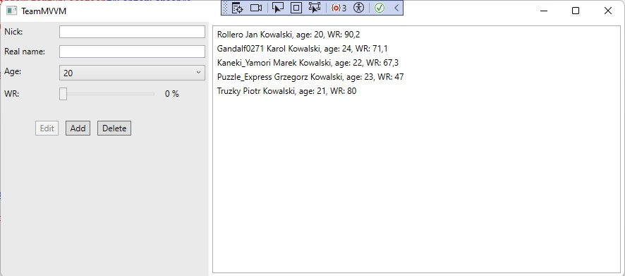
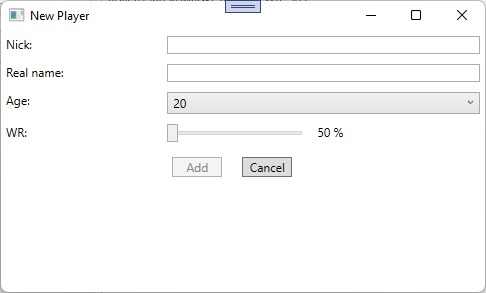

#TeamMVVM

## Description

TeamMVVM (C#, .NET, MVVM, WPF) app allowing storing team players data to txt and xml file. Presentation of MVVM use (ObservableCollections, ICommand, custom TextBox with error validation).

## Features

- Presenting list of players via MVVM
- Ability to add, edit, and delete players
- Saving team players data to txt and xml file
- Loading data from resource file on app start

## Screenshots

Main window of the app

Adding player window

## Roadmap

- All planed funcionalities has been implemented.

## Deployment and running

Clone the project.

Install .NET 8

Run it from Visual Studio.
